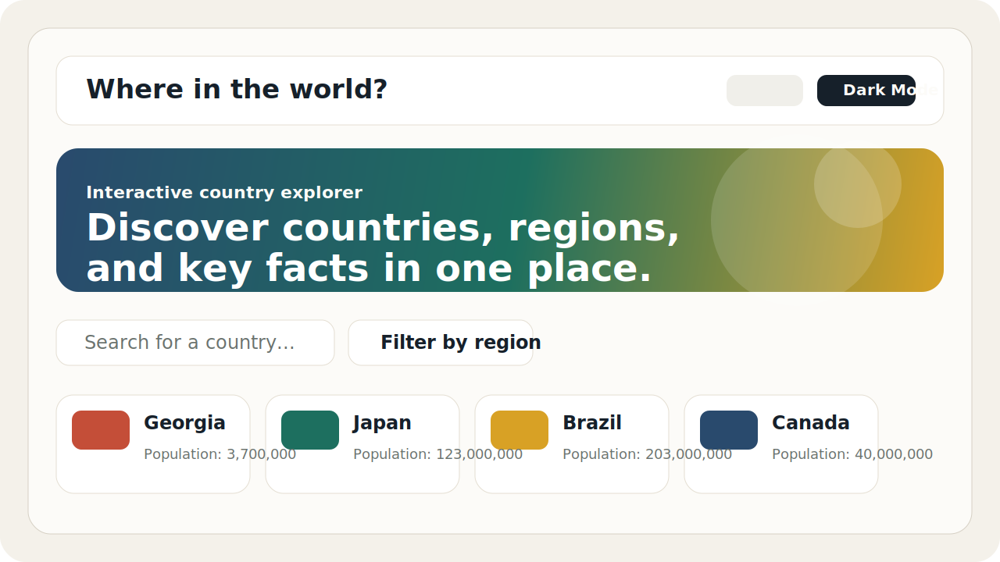

# Countries Explorer



Countries Explorer is a responsive React application for browsing country data through a fast, card-based interface. It combines region filtering, keyword search, a detail view, pagination, and a featured slider to make large datasets easier to explore.

The project uses the Rest Countries v5 API behind a local proxy and a Vercel serverless function, so the API token is not exposed directly from browser requests.

## Highlights

- Browse a curated list of countries in a clean card layout
- Search countries by name in real time
- Filter countries by region
- Open a dedicated detail page for each country
- Toggle between light and dark mode
- Paginate large result sets for better performance and readability
- Use a protected API integration for local development and Vercel deployment

## Preview

The interface is designed around quick scanning: a featured hero slider, compact country cards, simple filters, and a detail view for deeper information such as capital, languages, currencies, and borders.

## Tech Stack

- React 19
- TypeScript
- Vite
- Tailwind CSS
- React Router
- Axios
- Vercel Serverless Functions

## Project Structure

```text
.
|- api/                 # Serverless API route for Vercel
|- public/              # Static assets and README preview image
|- src/
|  |- api/              # Frontend API client and response normalization
|  |- components/       # Reusable UI components
|  |- context/          # Global app state
|  |- pages/            # Route-level views
|  |- types/            # TypeScript models
|- vite.config.ts       # Vite setup and local proxy config
```

## Getting Started

### 1. Install dependencies

```bash
npm install
```

### 2. Start development server

```bash
npm run dev
```

## Available Scripts

```bash
npm run dev      # Start local development server
npm run build    # Create production build
npm run preview  # Preview production build locally
npm run lint     # Run ESLint
```

## API Integration

This project uses the Rest Countries v5 API through a server-side boundary.

- In development, Vite proxies `/api/countries` to the upstream API and injects the hardcoded bearer token
- In production, Vercel serves `api/countries.js`, which forwards the request with the same hardcoded token
- The frontend only calls `/api/countries`
- API responses are normalized in `src/api/index.ts` so the UI works with a stable internal country model

## Deployment

The app is ready for Vercel deployment.

1. Push the repository to GitHub
2. Import the project into Vercel
3. Redeploy the project

## Notes

- The app filters excluded records at the API client layer before rendering
- The detail page uses the same normalized dataset as the home page to keep data consistent across routes
- The current setup stores the API token in source code rather than environment variables

## Future Improvements

- Add real language switching instead of the current placeholder action in the header
- Cache detail lookups separately for faster route transitions
- Add user-facing error states for API failures
- Add automated tests for API normalization and filtering behavior
